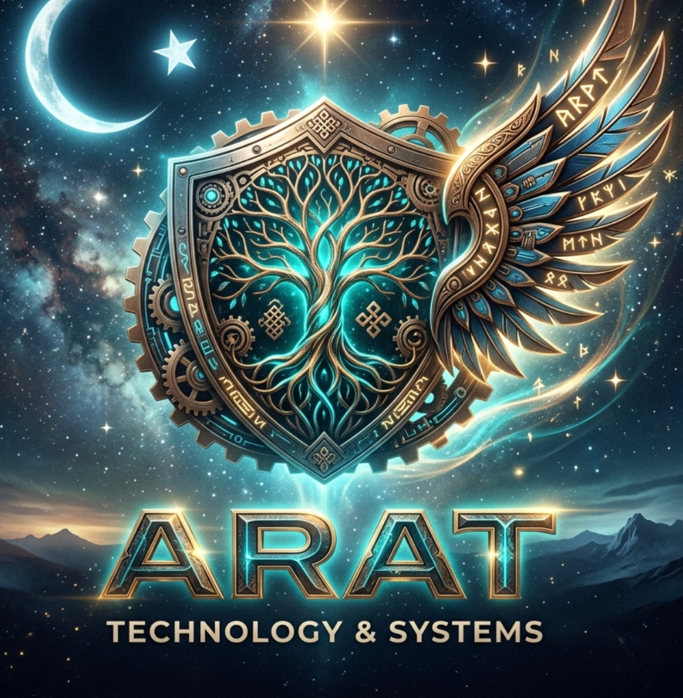
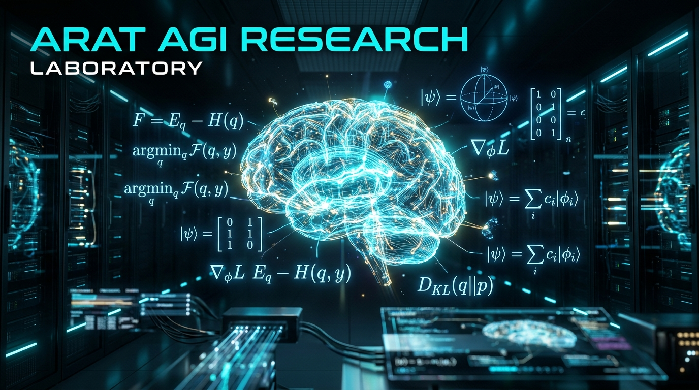
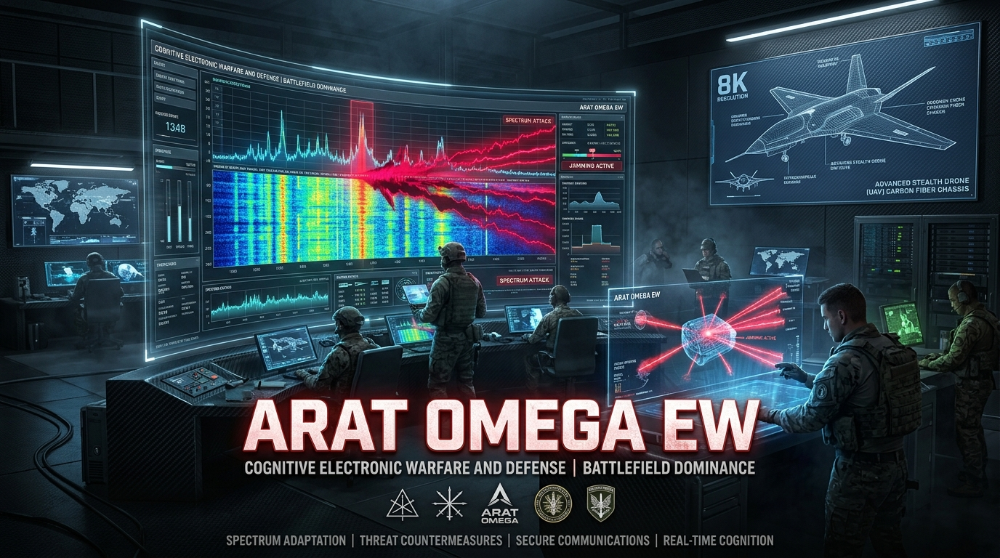
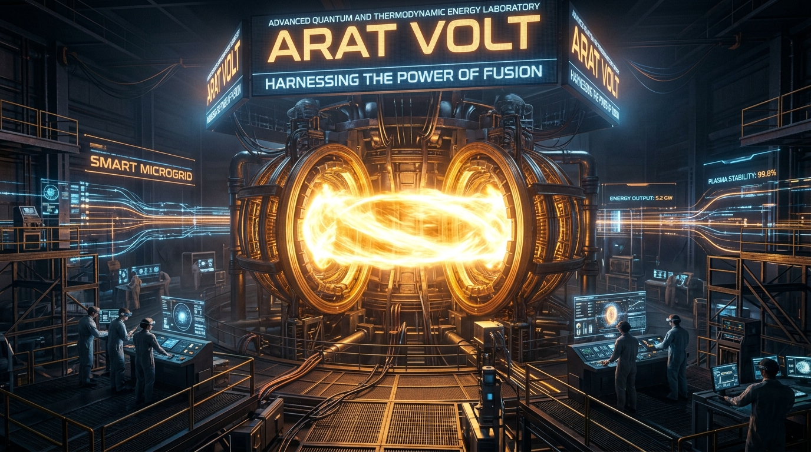

<div align="center">
  
  
  # ARAT LABS
  <p><b>Bilişsel Sistemler, Savunma Teknolojileri ve İleri Enerji Mimarileri</b></p>
  
  [](#-arat-labs-bilişsel-kontrol-paneli-showcase)
  [](https://github.com/arch-yunus/arat-agi-research)
  [](https://github.com/arch-yunus/arat_elektronik_harp)
  [](https://github.com/arch-yunus/ARAT-LABS)
</div>

<br>

> *"Yaratamadığım şeyi anlayamam."* - **Richard Feynman**
>
> *"Evrenin sırlarını bulmak istiyorsanız; enerji, frekans ve titreşim cinsinden düşünün."* - **Nikola Tesla**
>
> *"Zeka, evrenin kendisini anlamlandırma biçimidir. Bizim görevimiz bu süreci hızlandırmaktır."* - **David Deutsch**
>
> *"Makineler düşünebilir mi? Bu soruyu cevaplamak için, 'makine' ve 'düşünmek' kelimelerinin anlamlarını dikkatlice tanımlamamız gerekir."* - **Alan Turing**

---

## 🌌 Vizyonumuz ve Teknoloji Felsefemiz

**Arat Labs**, mevcut yapay zeka paradigmasının sınırlarını reddeden, zeka, spektrum ve enerjiyi tek bir termodinamik çatıda birleştiren çok disiplinli bir mühendislik ve araştırma şirketidir. Bizim inancımıza göre zeka; devasa veri merkezlerinde hapsolmuş, yalnızca istatistiksel olasılık dağılımları üreten monolitik bir yapı olamaz. Gerçek zeka; çevresiyle etkileşime giren, belirsizlik (sürpriz) anında hayatta kalabilen, kendi enerjisini otonom yönetebilen ve kısıtlı donanım kaynaklarıyla dahi deterministik kararlar alabilen **"bedenlenmiş" (embodied)** bir sistem olmalıdır.

Arat Labs çatısı altında teknoloji felsefesi ile sistem mimarisini birleştiriyoruz. Hedefimiz, dijital sınırları aşarak fiziksel dünyaya, elektromanyetik spektruma ve enerji şebekelerine hükmeden, "kendi varlığının farkında olan" otonom sistemler inşa etmektir.

---

## 🔬 Stratejik Araştırma ve Üretim Laboratuvarlarımız

Şirketimizin AR-GE ekosistemi, donanım ve yazılım bütünlüğünü sağlamak üzere tasarlanmış, birbirini besleyen üç ana koldan oluşur:

### 🧠 1. Arat AGI Research (Yapay Genel Zeka Araştırmaları)
<div align="center">
  
</div>

AGI araştırmalarımız; ajanların çevresel belirsizliği minimize etmesini hedefleyen **Serbest Enerji Prensibi (Free Energy Principle)**, Hiyerarşik Aktif Çıkarım (Active Inference) ve Kuantum Biliş (Quantum Cognition) teorilerine dayanır. Zekanın donanım sınırlarına hapsolmadan otonom olarak var olabilmesi için kavramsal ve matematiksel temelleri burada kodluyoruz.

*   **Bilişsel Orkestrasyon:** Belirli görevlerde uzmanlaşmış alt ajanların asenkron mikroservislerle iletişim kurduğu, vektörel hafıza yönetimi yapabilen "zihin ağları".
*   **Edge AI (Uç Yapay Zeka):** CUDA/C++ altyapısında özel GELU/SwiGLU aktivasyon fonksiyonları ve gömülü sistemler için Arena bellek yöneticileriyle sıfır gecikmeli (low-latency) deterministik çıkarım.
*   **Sensor Fusion (Sensör Füzyonu):** Genişletilmiş Kalman Filtresi (EKF) ve non-linear durum tahmin algoritmaları ile yapay zekanın fiziksel dünya entegrasyonu.
*   **Kuantum Bilişsel Modelleme:** Karar süreçlerinde belirsizlik ve tünelleme davranışlarını açıklayan kuantum durum modelleri (Bloch Küresi projeksiyonları).

### 📡 2. Arat OMEGA (Bilişsel Elektronik Harp ve Savunma Sistemleri)
<div align="center">
  
</div>

AGI araştırmalarımızın sahaya inmiş, taktiksel ve operasyonel uzantısıdır. Elektromanyetik spektrumda otonom egemenlik kurmayı hedefleyen **Bilişsel Elektronik Harp (Cognitive EW)** suite'imiz OMEGA, kapalı çevrim OODA (Observe, Orient, Decide, Act) döngüsüyle çalışır.

*   **Otonom Spektrum Hakimiyeti:** Wigner-Ville dağılımı ile LPI (Low Probability of Intercept) radar tespiti ve çok modlu yapay zeka (ResNet-1D + DenseNet) ile %98+ doğruluk oranına sahip modülasyon deşifresi.
*   **Karar ve Aksiyon (ADSS):** Bayesian Karar Destek Sistemleri ile belirsizlik altında en optimal jamming (karıştırma/aldatma) stratejisinin otonom olarak seçilmesi.
*   **SWaP-C Optimizasyonu (Boyut, Ağırlık, Güç ve Maliyet):** Karbon fiber şasi, aktif Peltier sıvı soğutma ve Jetson Orin Nano / SDR (USRP) donanımları ile fiziksel limitlerin zirvesinde görev kabiliyeti.

### ⚡ 3. Arat VOLT (Kuantum & Termodinamik İleri Enerji Sistemleri)
<div align="center">
  
</div>

Zekanın ve elektronik harp sistemlerinin sürdürülebilirliği için enerji üretimini, dağıtımını ve serbest enerji hasadını otonomlaştıran enerji kolumuzdur.

*   **Manyetik Tokamak Plazma Tutulumu:** D-T füzyon plazmasının kararlılığını mikrosaniye hassasiyetli AI geri besleme döngüleri ve süperiletken manyetik bobinlerle kontrol eden termonükleer optimizasyon.
*   **Bilişsel Akıllı Mikro-Şebekeler (Smart Grid):** Onsager Karşılıklılık Bağıntıları ve minimum entropi prensibi ile çalışan, süperiletken SMES depolama ünitelerine sahip otonom yük dengeleyici.
*   **Katı Hal GaN Güç Dağıtımı (PDU):** Yüksek frekanslı anahtarlama ile %99.4+ verim sağlayan GaN dönüştürücüler ve sıfır termal kaçak riskli lityum-seramik katı hal bataryalar.
*   **Termodinamik Kuantum Enerji Hasadı:** Uç ajanlar ve derin uzay araçları için Seebeck/Peltier hücreleri ile sistem atık ısısını geri kazanan sıfır kayıplı mikro üretim.

---

## 💻 Arat Labs Bilişsel Kontrol Paneli (Interactive Dashboard Showcase)

Bu depoda, ARAT Labs'in yukarıda özetlenen üç ana laboratuvarını görselleştiren, fütüristik, etkileşimli bir web uygulaması (**Bilişsel Kontrol Paneli**) yer almaktadır.

### 🌟 Öne Çıkan Özellikler ve Simülatörler:
*   **Bilişsel Akıllı Şebeke (Smart Microgrid) Simülatörü:** Güç kaynakları (Füzyon, Güneş, Katı Hal SMES) ve tüketici yükler (Edge AI, Savunma, Şehir) arasındaki canlı enerji akışını görselleştirir. Otonom yük dengeleme kabiliyetine sahiptir.
*   **Manyetik Tokamak Plazma Monitörü:** D-T füzyon plazmasının manyetik alan çizgilerini, parçacık girdaplarını ve plazma şok dalgalarını gerçek zamanlı simüle eder.
*   **Aktif Çıkarım (Active Inference) Simülatörü:** Ajanın engeller etrafından dolaşarak hedefe ulaşırken Serbest Enerjiyi (\(F\)) minimize etme sürecini görselleştirir.
*   **SDR Spektrum Analizörü & Demodülatör Ses Sentezi:** RF sinyalleri için şelale (spectrogram) grafik akışı ve Web Audio API ile aslına uygun ses demodülasyonu.
*   **Aktif Karıştırıcı (Jamming Barrage):** Spektruma yüksek güçte parazit basarak düşman radarını körelten DRFM simülasyonu.
*   **SWaP-C Donanım Telemetrisi:** Jetson Orin Nano CPU yükü, GaN güç amplifikatörü sıcaklığı ve aktif Peltier sıvı soğutma fanı telemetrisi.
*   **Kuantum Bloch Küresi:** Karar alma süreçlerindeki kuantum durum vektörlerini (\(|\psi\rangle\)) Lindblad Master Denklemi altında simüle eden interaktif 3D projeksiyon.

---

## 🖥️ CLI Konsol Komutları

Günlük ekranının altındaki giriş satırına aşağıdaki komutları yazarak arayüzü doğrudan kontrol edebilirsiniz:
*   `/help` - Kullanılabilir tüm komut listesini listeler.
*   `/energy` - Akıllı Şebeke ve Tokamak Füzyon telemetrisini listeler.
*   `/grid [balance|island|surge|quantum]` - Şebeke çalışma modunu değiştirir.
*   `/fusion [pulse|stabilize]` - Füzyon plazmasına manyetik darbe veya kilitleme uygular.
*   `/power [eco|normal|overdrive]` - Güç profilini ayarlar.
*   `/jam` - OMEGA Elektronik Harp karıştırıcısını açar veya kapatır.
*   `/stress` - Jetson Orin işlemcisine yapay stres testi yükleyerek Peltier soğutmanın devreye girişini tetikler.
*   `/status` - Güncel sıcaklık, güç tüketimi ve aktif modları gösteren özet durum raporu yazdırır.
*   `/theme [matrix|default|fusion|nebula]` - Arayüz rengini ve stil şemasını dinamik olarak değiştirir.
*   `/audio [on|off]` - SDR demodülatör ses çıkışını kontrol eder.
*   `/quantum <theta> <phi>` - Durum koordinatlarını el ile set eder.
*   `/obstacle [clear|random]` - Sandbox engellerini temizler veya rastgele dağıtır.
*   `/about` - ASCII Art logomuzu ve sürüm detaylarını konsola yazdırır.
*   `/reset` - Active Inference ajanını başlangıç konumuna döndürür.
*   `/clear` - Terminal günlük geçmişini temizler.

---

## 📈 Taktiksel Görev Senaryoları (Mission Control)

Portalda 7 adet önceden programlanmış taktik senaryo simülasyonu bulunmaktadır:
1.  **Sınır Ötesi EH Devriyesi (OMEGA):** İHA radar tespitini, Bayesian strateji seçimini ve GaN jamming yayınını simüle eder.
2.  **AGI Otonom Sürü Koordinasyonu:** 12 adet asenkron AGI ajanının engelleri aşmak için serbest enerjiyi minimize edişini canlandırır.
3.  **Kuantum Karar Destek Aşaması:** Yoğun RF parazit altında Lindblad kuantum durum dalgalanmalarını sönümlemeyi simüle eder.
4.  **Bilişsel Spektrum Tünelleme ve Elektronik Taarruz:** Çok parazitli bir ortamda kuantum karar, rota çizimi ve +48 dBm overdrive jamming atağını birleştirir.
5.  **Akıllı Şebeke Siber-Fiziksel Savunma & Aşırı Yük İzolasyonu (VOLT):** Mikro-şebekede bilişsel yük dengeleme ve katı hal SMES rezervi aktivasyonu.
6.  **Manyetik Tokamak Plazma Kırılma Önleme ve Manyetik Kilitleme:** Füzyon reaktöründe MHD kararsızlıklarını mikrosaniye hassasiyetli darbe ile düzelterek sürekli net enerji üretimi.
7.  **Derin Uzay / Uç Platform Termodinamik Enerji Hasatlama:** Sıfır harici enerjiyle sistem atık ısısını geri dönüştüren termodinamik serbest enerji döngüsü.

---

## 🚀 Kurulum ve Çalıştırma

Arayüz tamamen tarayıcı tabanlı (HTML5/CSS3/Vanilla JS) kodlanmıştır ve herhangi bir kütüphane bağımlılığı gerektirmez. Ayrıca **PWA (Progressive Web App)** ve **Docker** desteği mevcuttur.

### Seçenek 1: Yerel Python Sunucusu
```bash
git clone https://github.com/arch-yunus/ARAT-LABS.git
cd ARAT-LABS
python -m http.server 8000
```
Tarayıcınızdan `http://localhost:8000` adresine gidin.

### Seçenek 2: Docker ile Çalıştırma
```bash
docker-compose up -d
```
Tarayıcınızdan `http://localhost:8000` adresine gidin.

---

## 🤝 Katkıda Bulunma (Contributing)

Arat Labs, açık bilim ve açık kaynak kültürüne sıkı sıkıya bağlıdır. Bilişsel mimariler, otonom karar destek sistemleri, elektronik harp teknolojileri veya termodinamik enerji optimizasyonları üzerine yürüttüğümüz projelere katkı sağlamak isteyen tüm mühendislere ve araştırmacılara kapımız açıktır.

Katkı sağlamak için bir **Pull Request (PR)** açabilir veya karşılaştığınız sorunları **Issue** açarak bildirebilirsiniz.

<br>

<div align="center">
  <p><b>Arat Labs Enterprise</b> © 2026 | <i>Geleceği Bugünden İnşa Ediyoruz.</i></p>
</div>